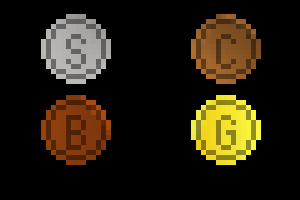

# Minetest-Mod: coins

 

## What is this?

This is a small mod for minetest, which adds coins (from steel, from bronze, from copper and from gold) to the game.

## How to install?

Locate the mods-folder of your minetest(-server)-installation.

Click the *clone or download*-button in GitHub-Repository and download the ZIP-file to the mods-folder by clicking *Download ZIP* or if you have git installed call the following in your mods-folder:
	
	git clone git@github.com:mflink3012/coins.git

Now you can select this mod in you minetest-client for singleplayer (e.g. for testing). If you want to use it on your minetest-server you have to edit the world's corresponding ``world.mt`` (inside the specific world-folder) and add

	load_mod_coins = true

to its end.

## Which dependencies?

See shipped [depends.txt](depends.txt).

## How to use?

1. Melt one steel-ingot to two steel-coins in furnace
2. Melt one copper-ingot to two copper-coins in furnace 
3. Melt one bronze-ingot to two bronze-coins in furnace
4. Melt one gold-ingot to two gold-coins in furnace

## Known issues?

See the `issues`-tab in GitHub-Repository.

## Tested with?

minetest 0.4.15

## What license?

GPL 3.0 (See the [LICENSE](LICENSE)-file shipped or <https://www.gnu.org/licenses/gpl-3.0.txt> for details.)